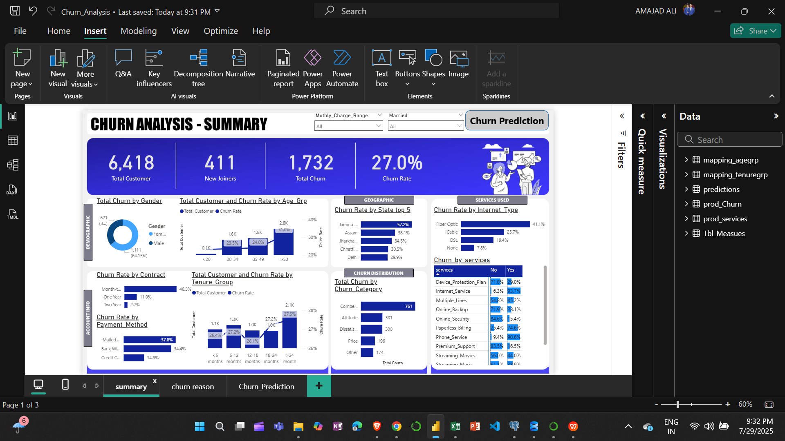
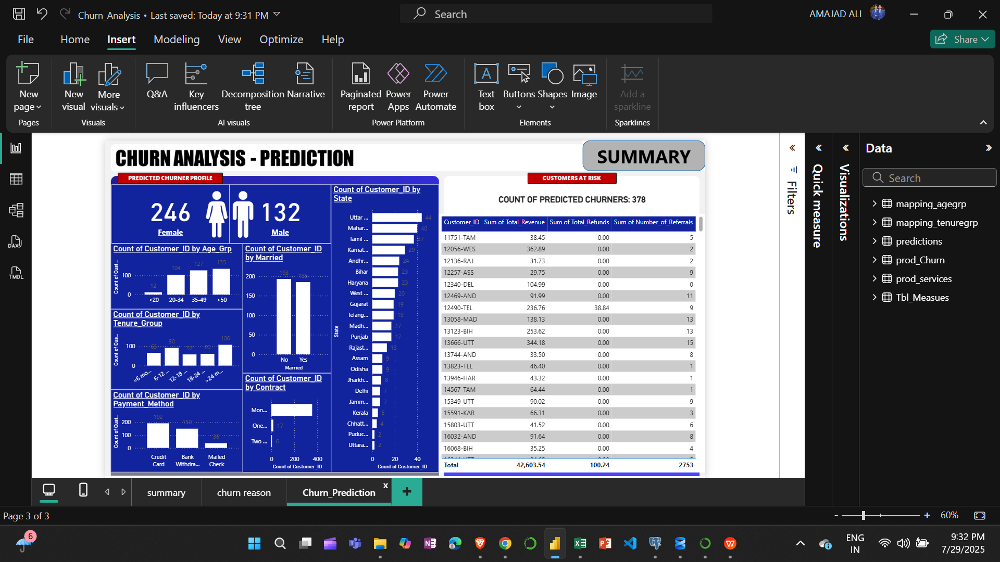

# 📊 Churn Analysis Project — Power BI + Machine Learning + SQL

## 🔍 Objective
This project aims to analyze and predict customer churn using SQL for data handling, Power BI for visualization, and Machine Learning (Python) for churn prediction. The insights help businesses reduce customer loss and improve retention strategies.

---

## 📊 Power BI Dashboard (Screenshots)

### 📍 Summary Page


### 📍 Prediction Page



---

## 🧰 Tools & Technologies Used

| Tool / Language         | Purpose                                      |
|-------------------------|----------------------------------------------|
| **Power BI**            | Interactive dashboard for churn insights     |
| **SQL**                 | Data extraction, cleaning, joins             |
| **Python (Pandas, Sklearn, etc.)** | Data preprocessing and ML modeling     |
| **Jupyter Notebook**    | ML model training and prediction generation  |

---

## 📁 Project Structure

---

## 📈 Power BI Dashboard Highlights

- **Total Customers, New Joiners, Churn Rate**
- **Churn by**: Age Group, Gender, Contract Type, Tenure, Payment Method, Services
- **Geographic Churn**: Top 5 states with high churn
- **Predicted Churn**: At-risk customers based on random forest model

---

## 🤖 Machine Learning Workflow

1. **Data Preprocessing** (Nulls, Encoding, Feature Engineering)
2. **Model Training** (Logistic Regression / Random Forest)
3. **Evaluation** (Accuracy, Confusion Matrix, AUC)
4. **Output**: Customer IDs with predicted churn status

---

## 🧪 Run the ML Script

```bash
# Step 1: Clone the repository
git clone https://github.com/your-username/churn-analysis-ml-sql-powerbi.git
cd churn-analysis-ml-sql-powerbi

# Step 2: Install required Python packages
pip install -r ml_model/requirements.txt

# Step 3: Open and run the notebook
jupyter notebook ml_model/model_training_script.ipynb


